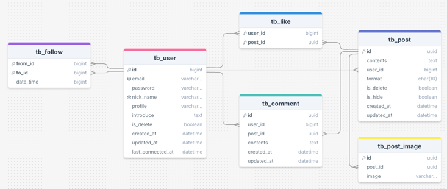
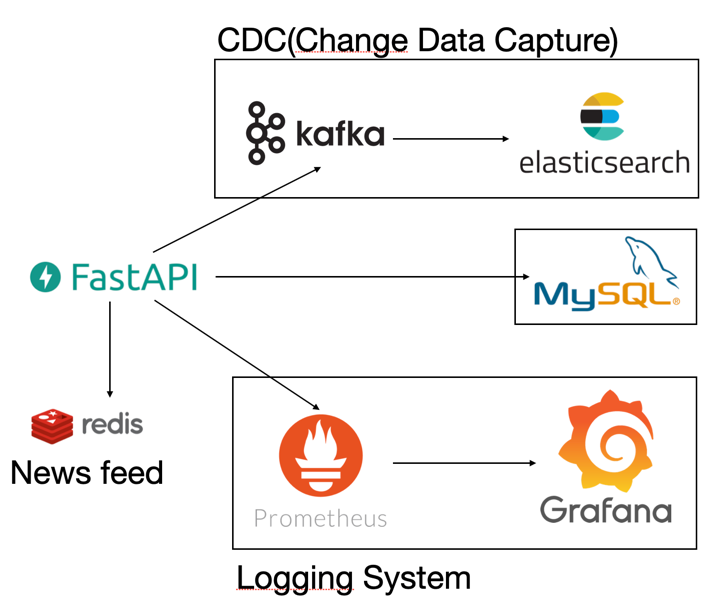

# sns project

# DB table schema


# Project Architecture




# 주요 설계 내용

1. 사용자 뉴스 피드 시스템(Fan-Out)
   - 기존 Mysql을 사용한 뉴스피드 시스템 사용자 500명 일때 P99 10초 발생
   - Redis를 사용한 Fan-Out 기능 구현(Post 정보들을 모두 Redis에 저장) 사용자 500명 일때 P99 400ms 단축
   - Redis에 있는 Post에 정보들을 가져올 때 시리얼라이즈 하는 과정에서 200ms씩 소요
   - Post 정보들을 전부 저장하는 방식이 아닌 Post id 값만을 저장후 사용자 500명 일때 P99 250ms로 150ms 단축
2. post data CDC(데이터 변경 캡쳐)
   - POST 검색 페이지 개발중 locust를 사용해 성능 테스트중 2.3RPS와 P50 2초, P99 6초씩 발생
   - Kafka와 Elasticsearch를 사용한 POST CDC 시스템 구축으로 검색 성능 100RPS, P99 500ms로 단축
   - Kafka를 사용한 환경구축으로 초당 1만건 이상의 데이터 처리 시스템 구축
3. logging system
   - Prometheus - Grafana를 사용한 로깅 시스템 구축

* 해야할 작업들

## How to install

### Pre-requisites

- Python 3.10 or higher
- [Poetry](https://python-poetry.org/docs/#installation)

### Install dependencies

```bash
make install
```

## How to run

```bash
make run
```

## Environment variables
앱은 `.env` 파일 또한 지원합니다.
다음처럼 프로젝트 최상단 경로에 `.env` 파일을 작성하여 필요한 환경 변수를 로드할 수 있습니다.

```bash
# .env

WEB_HOST="0.0.0.0"
WEB_PORT="8000"
DATABASE_URL="mysql+aiomysql://<<id>>:<<pw>>@localhost:3306/sns_media"
DATABASE_ECHO="True"
REDIS_HOST="localhost"
REDIS_PORT="6379"
REDIS_DB="0"
ES_HOST="localhost"
ES_PORT="9200"
ES_ID="<<ES_ID>>"
ES_PASSWORD="<<ES_PASSWORD>>"
ES_VERIFY_SSL="False"
CORS_ORIGINS="*"
CORS_CREDENTIALS="True"
CORS_METHODS="*"
CORS_HEADERS="*"
SECRET_KEY="<<SECRET_KEY>>"
```

관련 코드는 [`config.py`](./src/config.py)에서 확인할 수 있습니다.

## How to develop

### Install dependencies

```bash
make install-dev
```

### How to test

```bash
make test
```

### docker build
`export HOST_IP=$(ipconfig getifaddr en0)`
`docker-compose up -d`

### How to build

```bash
make build
```

### Others

- 파이썬 포매팅 도구로 [black](https://github.com/psf/black), [isort](https://github.com/PyCQA/isort) 그리고 [pycln](https://github.com/hadialqattan/pycln)을 사용합니다.
  - [pre-commit](https://pre-commit.com/)을 사용하여 커밋 전에 자동으로 포매팅을 적용합니다.
  - `make format` 명령어를 사용하여 포매팅을 적용할 수 있습니다.
- [pytest](https://docs.pytest.org/)를 사용하여 테스트를 작성합니다.
  - `make test` 명령어를 사용하여 테스트를 실행할 수 있습니다.
- `make help` 명령어로 실행가능한 명령어들을 확인할 수 있습니다.
